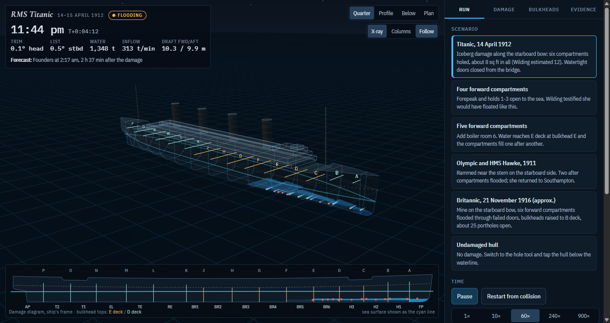

# sinksim

A deterministic, time-domain ship flooding and sinking simulator. Buoyancy, flood water and free-surface moments all
come from one geometric representation of the hull (vertical columns, later voxels) at the ship's true attitude;
water moves between spaces through a hydraulic network of doors, bulkhead tops, deck openings and breaches; a damped
rigid body carries the ship in heave, pitch and roll. No lookup tables, no scripted outcome. RMS Titanic on the night
of 14 April 1912 is the first ship and the calibration target; the engine itself is ship-agnostic.



## What is here today

| Piece | State |
|---|---|
| **C++ reference engine** (`engine/`) | Single-source kernel that compiles unchanged as CPU and CUDA code (WebAssembly to come); reproduces the original JavaScript model **bit for bit** at every step of the 1912 run, and its whole validation table, on Windows and Linux |
| **CUDA batch engine** (`engine/cuda`) | One thread block per simulation, hundreds at a time; its results are reproduced **bit for bit** by the CPU in portable numerics, so the GPU is checked exactly rather than "close enough" |
| **Portable numerics** | fdlibm's sin, cos and pow as host-and-device functions plus a canonical reduction order, in double and in mixed precision: the same bits on every CPU and on the GPU, verified across Windows, Linux and the RTX 4070 Ti SUPER |
| **Sweeps and calibration** | A sweep is a file: per instance, scale factors on connection kinds and door or opening overrides; it runs on the CPU or the GPU with identical results, and `tools/py/calibrate_gpu.py` runs the oracle's own calibration objective over 1,320 GPU evaluations in under a minute |
| **Frozen oracle** (`oracle/js`) | The original JavaScript core, viewer and notes, hash-listed; golden traces and validation tables are exported from it |
| **Compiled Titanic model** (`ships/titanic`) | 4,408 hull columns, 64 spaces, 290 connections; 11 scenarios from 1912 to Olympic-Hawke and Britannic |
| **Acceptance tests** (`tests/`) | Unit tests, a step-by-step and window-by-window golden check, and the validation comparison, all under CTest |
| **Tools** (`apps/`, `tools/`) | `sinksim_run`, `sinksim_check`, `sinksim_validate`; the exporter, golden writer and self-check on the Node side; a trace diff in Python |
| **Vendored, oracle-exact math** (`third_party/`) | fdlibm for sin and cos, V8's pow semantics, nlohmann JSON; nothing is fetched at build time |

The deck-level ship model with real plans, the physics beyond the original model (lists, pumps, air, the break-up),
Bayesian calibration with bands and the new viewer are the roadmap: `docs/ROADMAP.md`.

## The 1912 run, as the engine computes it

Calibrated with four parameters against Halpern's eyewitness-derived trim curve and three timeline events, then
checked against cases that were not used in the fit (`docs/VALIDATION.md`):

| Check | Witnessed | Model |
|---|---|---|
| Trim at 12:10 / 12:55 / 1:20 / 2:15 | 1.8° / 3.2° / 4.0° / 10° | 1.65° / 3.5° / 4.15° / 9.6° |
| Water over bulkhead F (Wheat) | 12:55 | 12:56 |
| Bridge under | 2:15 | 2:14 |
| Foundered | 2:20 (broke at 2:17) | 2:17 |
| Four forward compartments open | floats (Wilding) | floats, 2.0° by the head |
| Add boiler room 6 | sinks (Wilding) | founders at 2 h 14 min |
| Olympic and HMS Hawke, 1911 | reached port | floats, 0.7° by the stern |
| Britannic, 1916, portholes open | about 55 min | 50 min |

What it does not get right yet, and why, is written down in `docs/ROADMAP.md`: the 5° starboard list at 11:50 and the
10° to 15° port list after 1:50 need room-level topology the 64-space model cannot express, and the end of the run is a
pitch runaway rather than the hull breaking.

## Build and run

Windows (Visual Studio 2022 with the C++ workload, CMake 3.25 or newer):

```
tools\build\msvc.cmd all
```

That configures the `msvc-release` preset with Ninja, builds, and runs every test. With the CUDA toolkit installed,
`tools\build\msvc.cmd all msvc-cuda-release` adds the GPU engine and its parity tests. Linux or WSL with GCC:
`cmake --preset gcc-release && cmake --build --preset gcc-release && ctest --preset gcc-release`.

Then, from the repository root:

```
build\msvc-release\bin\sinksim_run ships\titanic\titanic64.ship.json ships\titanic\sims\titanic.sim.json --history
build\msvc-release\bin\sinksim_check ships\titanic\titanic64.ship.json ships\titanic\sims\titanic.sim.json data\golden\titanic64\titanic.trace.json
build\msvc-release\bin\sinksim_validate ships\titanic\catalog.json --compare data\validation\titanic64\validation.oracle.json
build\msvc-cuda-release\bin\sinksim_cuda_run ships\titanic\titanic64.ship.json ships\titanic\sims\titanic.sim.json --count 264 --perturb
build\msvc-release\bin\sinksim_sweep ships\titanic\titanic64.ship.json ships\titanic\sims\titanic.sim.json tests\sweeps\smoke.sweep.json --numerics portable32
python tools\py\calibrate_gpu.py --rounds 5 --batch 264
```

Every tool takes `--numerics oracle|portable|portable32|std` (`docs/DETERMINISM.md`). Throughput on this machine:

| Engine | Rate |
|---|---|
| CPU, oracle numerics, one thread | 25,000 steps/s; the 2 h 37 min sinking in 1.5 s |
| GPU, double precision, batch of 264 or more | 503,000 steps/s aggregate; 800 full sinkings per minute |
| GPU, mixed precision, batch of 264 or more | 1,190,000 steps/s aggregate; 1,900 full sinkings per minute |

The original viewer runs without any build: open `oracle/js/out/titanic.html`.

Regenerating the data from the oracle needs Node 24 (`.nvmrc`): `npm run export`, `npm run golden`, `npm run perstep`,
`npm run validate:oracle`, `npm test`.

## How correctness is established

The engine is not "close to" the original model; it is held to it exactly. The golden trace carries the complete state
(pose, rates, volumes, levels, centroids) at every one of the first 400 steps and every 60 s afterwards. The check
restarts the engine from each record and compares the next one, then runs end to end. Today every difference is zero.
That is possible because the arithmetic is reproducible by construction: strict floating point, fixed-order sums,
and the same transcendental functions the JavaScript engine uses (fdlibm's sin and cos, the platform's pow as V8
calls it). The GPU is held to the same standard: it computes a second, platform-independent set of numerics that the
CPU emulates exactly, so a GPU trace is checked with tolerance zero too. The measurements and the policy are in
`docs/DETERMINISM.md`, including why a whole-run tolerance test would be meaningless: the model amplifies a one-ulp
difference to tens of seconds once the first bulkhead overflows.

## Repository

```
AGENTS.md            rules for anyone working here (CLAUDE.md points to it)
engine/              the C++ engine: kernel headers, host model, IO, simulation driver
apps/                sinksim_run, sinksim_check, sinksim_validate
tests/               unit tests and the acceptance tests (CTest), JS tests
oracle/              the frozen JavaScript model with its manifest
ships/               compiled ship models and scenarios (generated, hashed)
data/                golden traces and validation tables (generated, hashed)
tools/               build wrapper, Node tools that drive the oracle, Python analysis
third_party/         vendored fdlibm, v8math, nlohmann JSON, V8 reference files
docs/                architecture, physics, formats, determinism, validation, roadmap, ADRs, session logs
viewer/              reserved for the engine-backed viewer
```

## Documentation

`docs/ARCHITECTURE.md` (layers and data flow), `docs/PHYSICS.md` (the equations of scheme v1), `docs/FORMATS.md`
(every file format), `docs/DETERMINISM.md` (measurements and acceptance), `docs/VALIDATION.md` (targets and results),
`docs/ROADMAP.md` (phases and why in that order), `docs/SOURCES.md` (bibliography), `docs/adr/` (decisions),
`docs/STATUS.md` (where things stand), `docs/sessions/` (what each working session did).

## License and credits

MIT (`LICENSE`). Third-party code under its own licenses in `third_party/`. The original JavaScript model was built
from the British Wreck Commissioner's report, Edward Wilding's evidence, Samuel Halpern's stability, trim and list
studies, Hackett and Bedford's 1996 RINA paper and Mark Chirnside's work on the Olympic class; the full list and what
each source gives is in `docs/SOURCES.md`.
